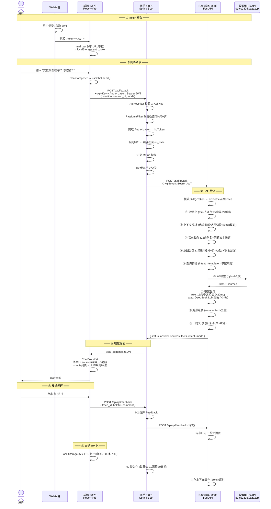
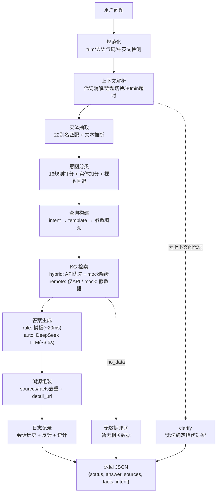

# qa-system 项目完成度总结

> 面向文物知识领域的智能问答子系统，基于 KG（Neo4j）+ RAG + LLM 架构。

---

## 一、已完成

### 1.1 核心问答（P0，100%）

| 需求 | 方案 |
|------|------|
| 自然语言问答 `POST /api/qa/ask` | Spring Boot 网关 → FastAPI RAG 管道 → Neo4j 知识图谱 → 规则/LLM 回答 |
| 意图识别 + 实体抽取（16类） | 关键词打分 + 实体别名匹配（`intent_rules.json` / `entity_aliases.json`） |
| 意图 → Cypher 查询 | 16 个模板映射（`templates.py`），支持简单属性查询 + 复杂关系查询 |
| KG 检索 | 数据组 API（`https://se-cs2305.yazs.top`）为主，mock 数据为降级兜底 |
| no_data 兜底 | 证据不足时返回 `status=no_data`，明确提示"暂无相关数据"，禁止编造 |
| 答案溯源 | 每条回答附带 `source_name` + `detail_url`，前端可点击跳转 |
| ≥10 类简单问答 | 实际覆盖 **12 类**：收藏地/年代/材质/类型/介绍/尺寸/作者/作者生平/同作者作品/同朝代文物/推荐/馆藏量 |

### 1.2 多轮对话（P2，已完成）

| 能力 | 方案 |
|------|------|
| 代词指代（"它的材质"） | 正则匹配代词前缀 → 回查上文 assistant 实体 → 继承实体 |
| 话题切换检测 | 信号词（"换个话题"）+ 意图变化 + 实体不相关三重判断 |
| 上下文超时清理 | 30 分钟无活动自动过期（`context_resolver.py`） |
| 前端会话持久化 | localStorage（5天TTL，每小时GC，每会话上限500条） |
| 后端历史兜底 | H2 持久化 + 每日凌晨 30 天清理 |

### 1.3 复杂问答（P2，已完成）

| 意图 | 数据组 API | 能力 |
|------|-----------|------|
| `multi_hop`（多跳推理） | `GET /graph/neighbors/{id}?depth=2` | 文物关联子图 → 路径拼接 |
| `compare_artifacts`（文物对比） | `POST /artifacts/compare` | 双文物ID → 并排属性对比表 |
| `artifact_statistics`（统计） | `GET /stats/distribution` | 四维分布数据（类型/材质/博物馆/年代） |
| `path_query`（流转路径） | `GET /graph/neighbors/{id}?depth=2` | 文物邻居图 → 收藏轨迹 |

### 1.4 反馈机制（P2，已完成）

- 前端：每条回答底部的 👍/👎 按钮
- 后端：`POST /api/qa/feedback` 落库 + 转发 RAG 服务
- RAG 服务：内存日志 + `/api/qa/summary` 查询统计摘要

### 1.5 鉴权与限流（P1，已完成）

| 机制 | 方案 |
|------|------|
| API 鉴权 | `X-Api-Key` 头校验，`ApiKeyFilter` 拦截 `/api/qa/*`，health 免鉴权 |
| 限流 | IP 级别滑动窗口，60s/60次（`RateLimitInterceptor`），429 响应 |
| CORS | 允许 `localhost:5173`，支持预检请求 |

### 1.6 工程化配套（已完成）

| 项目 | 内容 |
|------|------|
| 测试 | 19 单元 + 36 回归 = **55 用例**（pytest），前端 **3 用例**（Vitest），后端 **16 用例**（JUnit） |
| 集成测试 | 33 个真实 KG + LLM 全链路用例 |
| 测试题集 | `questions.json`，33 条，覆盖全部 16 类意图 |
| API 契约 | `specs/api-contract.md`，含请求/响应 schema、错误码（2000~5004）、鉴权/限流规则 |
| Docker | 三服务 Dockerfile + `docker-compose.yml`（健康检查 + 依赖顺序） |
| 脚本 | `start-dev.ps1`、`stop-dev.ps1`、`docker-deploy.ps1`、`run-tests.ps1`、`quality.ps1` |
| 代码质量 | Ruff（Python）128处自动修复 + ESLint（前端）+ Checkstyle/JaCoCo（Java）+ GitHub Actions CI |
| Web 端对接 | URL参数传token（`?token=<JWT>`）、双重鉴权（X-Api-Key + JWT）、局域网跨域 |

---

## 二、技术架构一览

### 2.1 系统拓扑

```
┌──────────────┐     ┌──────────────┐     ┌──────────────┐     ┌──────────────┐
│  web-frontend │────▶│backend-spring│────▶│rag-service-  │────▶│  数据组 KG    │
│  React 19    │     │ Spring Boot  │     │    node       │     │  API         │
│  Vite 8      │     │ :8081        │     │ FastAPI :8000│     │ se-cs2305.   │
│  :5173       │     │              │     │              │     │ yazs.top     │
└──────────────┘     └──────────────┘     └──────────────┘     └──────────────┘
      │                      │                     │
  Chat UI               鉴权/限流              意图识别
  侧边栏                历史(H2)               实体抽取
  来源展示              反馈落库               KG检索
  反馈按钮              CORS                   答案生成
  Token管理             指标监控               溯源/日志
  暗色/亮色             JWT透传                中/英文自适应
```

### 2.2 完整数据流（端到端 Mermaid）



### 2.3 RAG 管道核心流程



## 三、剩余未完成

| 项目 | 说明 | 优先级 |
|------|------|--------|
| **文档 RAG（向量检索）** | 在 KG 之外增加文档检索通路：文物介绍/论文/展览说明 → embedding → pgvector → 语义召回 → LLM 融合回答 | 低（S4 选做） |
| **LangChain 集成** | 用 LangChain 的 RetrievalChain 统一 KG + 文档双路检索，替代当前手写管道 | 低（S4 选做） |
| **性能测试** | NFR-001 要求常规问答 <2s，rule 模式实测 ~1.5s 达标，但未系统压测 | 低 |

---

## 四、数据统计

| 维度 | 数量 |
|------|------|
| 意图类型 | 16 类（12简单 + 4复杂） |
| 实体类型 | 4 类（文物/博物馆/朝代/作者） |
| 实体别名 | 22 条（中/英双语） |
| Cypher/API 模板 | 16 个 |
| 对接数据组 API 端点 | 8 个 |
| 自动化测试 (pytest) | 55 用例（19 单元 + 36 回归） |
| 集成测试 (真实KG) | 33 用例 |
| 前端测试 (Vitest) | 3 用例 |
| 后端测试 (JUnit) | 16 用例 |
| 测试题集 | 33 条 |
| 代码文件（Java + Python + TS） | ~55 个 |
| Bug 修复 | 15 个 |
| Ruff 代码质量修复 | 128 处 |
| 交付文档 | 9 份（SRS/设计/管理/模块/完成度/测试/用户手册/API契约/会议纪要×7） |
